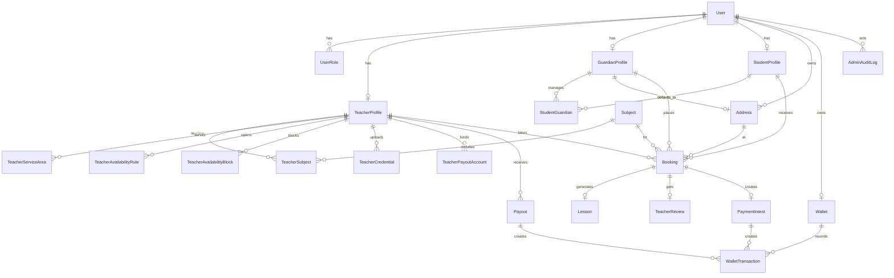

# TuneTime 后端 Schema 通俗说明

基于后端 Prisma schema：
[schema.prisma](/Users/luke/TuneTime/TuneTime-Backend/prisma/schema.prisma)

这份说明尽量不用数据库术语，而是从“这个系统在管什么业务”来解释当前有哪些 model、它们之间怎么连接。

## 1. 一句话先看懂这套数据结构

这套 schema 本质上是在描述一个“上门家教平台”的完整链路：

1. 平台先管理账号和身份
2. 老师提交资料、科目、可服务区域和可约时间
3. 家长维护自己、孩子和上课地址
4. 家长发起预约，形成订单
5. 订单落地后生成课程记录
6. 课后家长评价老师
7. 如果后面要做支付、钱包、提现，schema 也已经预留好了

如果用一句更短的话概括，就是：

`User -> 身份资料 -> Booking -> Lesson -> Review`

支付结算链路则是另一条配套主线：

`Booking -> PaymentIntent -> WalletTransaction -> Payout`

## 2. 当前有哪些 model

当前 schema 一共可以分成 5 组。

### 2.1 账号与权限层

这一层解决“你是谁、怎么登录、有什么身份、后台操作是谁做的”。

| Model | 通俗解释 |
| --- | --- |
| `User` | 平台里的基础账号。所有人先有账号，后面再挂接老师/学生/家长等身份资料。 |
| `PasswordCredential` | 用户的密码信息。相当于“本地账号密码登录”的凭证。 |
| `Account` | 第三方登录账号绑定信息。 |
| `Session` | 登录会话。谁当前是登录状态、token 什么时候过期。 |
| `VerificationToken` | 验证码/验证 token，一般用于验证类流程。 |
| `Authenticator` | 更高级的登录凭证，比如 passkey / WebAuthn。 |
| `UserRole` | 用户在平台里的角色，比如超级管理员、管理员、老师、学生、家长。一个用户可以有多个角色。 |
| `AdminAuditLog` | 后台操作日志。谁在什么时候对什么对象做了什么操作。 |

### 2.2 老师侧资料层

这一层解决“老师是谁、会教什么、去哪里上课、什么时候有空、资质是否审核通过”。

| Model | 通俗解释 |
| --- | --- |
| `TeacherProfile` | 老师主档案。包含展示名、简介、全职/兼职、审核状态、基础课时费、评分、面试和协议确认等。 |
| `TeacherSubject` | 老师和科目的关联表。因为一个老师可以教多个科目，一个科目也可以被多个老师教，所以需要单独一张表记录，并且还能带上该科目的价格和经验。 |
| `TeacherServiceArea` | 老师的服务范围，比如哪个城市、哪个区、可接受多远距离上门。 |
| `TeacherAvailabilityRule` | 老师的固定可约时间规则，比如每周几几点到几点能接单。 |
| `TeacherAvailabilityBlock` | 老师临时不可约时间，比如请假、临时占用。 |
| `TeacherCredential` | 老师上传的资质材料，比如教师证、身份证、学历证明、无犯罪记录等，以及平台审核结果。 |
| `TeacherPayoutAccount` | 老师收款/提现账户，比如支付宝、微信、银行卡。这个更偏结算能力。 |
| `Payout` | 平台给老师打款/提现申请记录。 |

### 2.3 家长与学生侧资料层

这一层解决“谁来下单、孩子是谁、双方是什么关系、默认去哪里上课”。

| Model | 通俗解释 |
| --- | --- |
| `GuardianProfile` | 家长主档案。包含联系人、紧急联系人、默认服务地址等。 |
| `StudentProfile` | 学生主档案。包含年级、生日、学校、学习目标、特殊需求等。 |
| `StudentGuardian` | 学生和家长的关系表。因为一个学生可能对应多个监护人，一个家长也可能管理多个孩子。 |
| `Address` | 地址簿。记录联系人、电话、省市区、街道、经纬度、是否默认地址。 |

补充一个很重要的点：

`StudentProfile.userId` 是可空的，这意味着孩子可以只有档案、没有独立登录账号。这很符合实际场景，因为很多下单都是家长代孩子完成的。

### 2.4 预约、上课、评价层

这一层是平台最核心的业务主线。

| Model | 通俗解释 |
| --- | --- |
| `Subject` | 科目表，比如钢琴、声乐、乐理等。 |
| `Booking` | 预约/订单主表。谁约了谁、给哪个孩子上什么课、在哪儿上、什么时候上、多少钱、当前状态是什么，都在这里。 |
| `Lesson` | 实际上课记录。用于记录签到签退、上课开始结束时间、老师总结、作业、成果视频、反馈提交时间等。 |
| `TeacherReview` | 家长课后评价。包含总评分、课堂质量评分、老师表现评分、评价内容和改进建议。 |

### 2.5 支付与资金层

这一层是交易闭环的配套能力。目前 schema 已经设计好了，但从项目文档看，MVP 阶段不一定全部开放。

| Model | 通俗解释 |
| --- | --- |
| `Wallet` | 用户钱包。记录可用余额、冻结余额、状态。 |
| `PaymentIntent` | 一笔订单准备怎么付钱、付了没有、第三方支付流水号是什么。 |
| `WalletTransaction` | 钱包台账流水。每一笔入账、出账、冻结、释放、退款、提现都可以在这里留下记录。 |

## 3. 最核心的连接关系

如果只抓住最关键的关系，这套 schema 可以这样理解。

### 3.1 `User` 是总入口

`User` 是整个系统的“根”。

- 一个 `User` 可以有多个 `UserRole`
- 一个 `User` 可以挂一个 `TeacherProfile`
- 一个 `User` 可以挂一个 `GuardianProfile`
- 一个 `User` 也可以挂一个 `StudentProfile`
- 一个 `User` 可以有多个 `Address`
- 一个 `User` 可以有一个 `Wallet`

也就是说，账号是底座，老师/家长/学生这些更多是“账号的业务身份”。

### 3.2 老师和科目是多对多

老师不是只教一个科目，科目也不是只属于一个老师。

所以 schema 不是直接把 `subjectId` 放在 `TeacherProfile` 里，而是用了中间表 `TeacherSubject`。

它的意义是：

- `TeacherProfile` 和 `Subject` 是多对多关系
- `TeacherSubject` 不只是“连一下”
- 它还承担了“这个老师教这个科目的价格、试听价、经验年限”这类业务信息

这是一个很标准也很合理的建模方式。

### 3.3 家长和学生也是多对多

现实里，一个孩子可能由父母共同管理，也可能还有祖辈监护；一个家长也可能有多个孩子。

所以这里也用了中间表 `StudentGuardian`。

它除了记录“是谁和谁的关系”，还记录了：

- 关系类型，比如父亲、母亲、祖辈
- 是否主监护人
- 是否有下单权限
- 是否能看课程记录

所以它本质上不只是“关系表”，而是一张“关系 + 权限”表。

### 3.4 `Booking` 是业务中枢

`Booking` 是这套 schema 里最关键的一张业务表。

每条预约都会同时连到：

- 一个老师：`teacherProfileId`
- 一个学生：`studentProfileId`
- 一个家长：`guardianProfileId`
- 一个科目：`subjectId`
- 一个上课地址：`serviceAddressId`

同时它还记录了：

- 上课开始和结束时间
- 订单状态
- 是否试听
- 老师何时接单
- 家长何时确认
- 价格和费用拆分
- 支付状态
- 课前计划摘要

可以把 `Booking` 理解成“把一次约课涉及的所有核心对象串起来的总单据”。

### 3.5 `Lesson` 和 `TeacherReview` 都是从 `Booking` 长出来的

业务上，一次预约如果正常进行，后面通常会继续产生两类记录：

- 一条 `Lesson`
- 一条 `TeacherReview`

它们在 schema 里都跟 `Booking` 是一对一关系：

- 一个 `Booking` 最多对应一条 `Lesson`
- 一个 `Booking` 最多对应一条 `TeacherReview`

这很符合业务语义：

- `Booking` 解决“约了什么”
- `Lesson` 解决“实际上课发生了什么”
- `TeacherReview` 解决“课后反馈怎么样”

### 3.6 支付和结算围绕 `Booking` 展开

支付链路也是从订单出发。

- 一个 `Booking` 最多对应一个 `PaymentIntent`
- 一个 `PaymentIntent` 可以带出多条 `WalletTransaction`
- 一个 `Wallet` 下面会挂很多 `WalletTransaction`
- 老师侧结算时，会用到 `TeacherPayoutAccount` 和 `Payout`

所以资金层不是孤立的，它是围绕订单做资金流转记录。

## 4. 用业务流程来理解这些表

如果按真实业务流程看，会更容易理解。

### 4.1 注册和身份建立

先创建 `User`。

然后根据身份，再补：

- `UserRole`
- `TeacherProfile`
- `GuardianProfile`
- `StudentProfile`

登录方式和安全相关信息则放在：

- `PasswordCredential`
- `Account`
- `Session`
- `Authenticator`

### 4.2 老师入驻

老师完成入驻时，通常会写入这些表：

- `TeacherProfile`
- `TeacherSubject`
- `TeacherServiceArea`
- `TeacherAvailabilityRule`
- `TeacherAvailabilityBlock`
- `TeacherCredential`

如果审核动作需要留痕，还会关联：

- `TeacherCredential.reviewedByUserId`
- `AdminAuditLog`

### 4.3 家长建档

家长侧通常会写入这些表：

- `GuardianProfile`
- `StudentProfile`
- `StudentGuardian`
- `Address`

也就是说，家长不是只维护自己，还要维护“孩子”和“服务地址”。

### 4.4 家长下单

当家长选好老师、科目、时间和地址后，会创建 `Booking`。

此时 `Booking` 会把这些对象都串起来：

- 老师
- 学生
- 家长
- 科目
- 上课地址

如果后续进入支付流程，还会继续生成：

- `PaymentIntent`
- `WalletTransaction`

### 4.5 实际上课

进入履约后，会落到 `Lesson`：

- 到课签到
- 签退
- 上课开始和结束时间
- 老师课后总结
- 作业
- 成果视频
- 反馈提交时间

所以 `Lesson` 是“履约证据”和“课后记录”的承载体。

### 4.6 课后评价

课程结束后，家长可以创建 `TeacherReview`。

这条评价会关联：

- 哪个订单
- 哪个老师
- 哪个学生
- 哪个家长

然后把评分沉淀下来，后续可以反哺到老师档案里的：

- `ratingAvg`
- `ratingCount`

## 5. 一张图看连接关系

## 6. 哪些是 MVP 主线，哪些更像后续预留

结合现有项目文档，这套 schema 里最接近当前主线的是：

- `User`
- `UserRole`
- `Subject`
- `TeacherProfile`
- `TeacherSubject`
- `TeacherServiceArea`
- `TeacherAvailabilityRule`
- `TeacherAvailabilityBlock`
- `TeacherCredential`
- `GuardianProfile`
- `StudentProfile`
- `StudentGuardian`
- `Address`
- `Booking`
- `Lesson`
- `TeacherReview`
- `AdminAuditLog`

而下面这些更像是支付结算能力的预留：

- `Wallet`
- `WalletTransaction`
- `PaymentIntent`
- `TeacherPayoutAccount`
- `Payout`

换句话说，这个 schema 现在已经不是“只能做 MVP”的水平了，而是：

- 核心业务主线已经能跑通
- 支付结算也提前留了完整骨架
- 后面扩功能时，不太需要大改表结构

## 7. 最后用一句人话总结

如果把整个后端想成一家线下家教平台的“总账本”，那这些 model 分别在做这些事：

- `User` 系列负责“这个人是谁、怎么登录、是什么身份”
- `TeacherProfile` 系列负责“这个老师能不能接单、教什么、什么时候有空、资质过没过”
- `GuardianProfile` / `StudentProfile` / `Address` 负责“是谁下单、给谁上课、在哪儿上”
- `Booking` 负责“这次约课到底约了什么”
- `Lesson` 负责“这次课实际上发生了什么”
- `TeacherReview` 负责“课后评价怎么样”
- `Wallet` / `PaymentIntent` / `Payout` 负责“钱是怎么流动的”

所以从结构上看，这是一套比较完整的“家教预约到履约再到结算”的后端数据模型。
