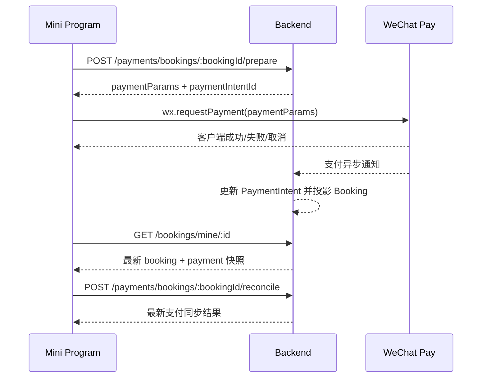

# TuneTime 前端对接文档：支付与双阶段登录

更新时间：2026-04-07

适用范围：

- TuneTime 小程序前端
- 当前后端仓库 `/Users/luke/TuneTime/TuneTime-Backend`
- 本次支付状态挂载架构提交

本文重点不是罗列全部后端接口，而是把本次提交中前端最需要对齐的几件事写清楚：

- 现在到底支持什么登录方式
- 微信登录和手机号验证目前是什么关系
- 微信支付该怎么拉起
- 支付成功后前端应该看什么字段，不应该看什么字段
- 哪些接口前端不能当作真实支付入口使用

## 1. 先说结论

### 1.1 当前后端已经实现的支付主链

当前后端已经支持这条真实支付链路：

```text
家长已登录
-> 老师接单，booking 进入 PENDING_PAYMENT
-> 前端调用 POST /payments/bookings/:bookingId/prepare
-> 前端调用 wx.requestPayment
-> 微信异步回调后端
-> 后端更新 PaymentIntent
-> 后端统一投影到 Booking
-> 前端通过 GET /bookings/mine/:id 轮询看到最终状态
-> 如回调延迟，可调用 POST /payments/bookings/:bookingId/reconcile 主动查单
```

### 1.2 当前后端关于登录的真实状态

当前代码里有两类登录相关接口：

- 已默认开放：短信验证码登录
- 已实现但默认未开放：微信小程序登录、绑定手机号

这意味着：

- 如果以后端默认 capability 为准，当前小程序仍应以短信验证码登录为主
- 如果准备启用“小程序先微信登录，再做手机号绑定”这条链路，需要后端在环境里开启：
  - `wechatAuth`
  - `bindPhone`

### 1.3 当前不是“微信登录后直接验证微信手机号”

当前后端没有实现“直接用微信 `getPhoneNumber` / 手机号解密结果完成绑定”的接口。

当前已实现的是：

1. `POST /auth/wechat/miniapp-login`
   - 用 `wx.login()` 得到的 `code` 换取 `openid/unionid`
2. `POST /auth/bind/phone/request`
3. `POST /auth/bind/phone/confirm`
   - 用短信验证码完成手机号绑定

所以前端现在要按“两步走”理解：

- 第一步：微信登录拿业务 token 和微信身份
- 第二步：短信验证绑定手机号

不是：

- 微信登录
- 直接信任微信手机号完成绑定

## 2. 当前 capability 结论

请前端启动时始终以 `GET /system/capabilities` 为准，不要在本地写死。

和本次对接最相关的 capability 当前默认值如下：

| capability | 当前默认值 | 前端含义 |
| --- | --- | --- |
| `smsAuth` | `true` | 短信登录可用 |
| `wechatAuth` | `false` | 微信小程序登录接口已实现，但默认未开放 |
| `bindPhone` | `false` | 手机号绑定接口已实现，但默认未开放 |
| `payment` | `true` | 支付准备、回调、主动对账接口可用 |
| `bookingMine` | `true` | 家长端订单列表和详情可用 |
| `teacherAccept` | `true` | 老师接单可用 |
| `cancelBooking` | `false` | 家长/老师主动取消仍默认未开放 |

前端建议：

- `wechatAuth=false` 时，不展示“微信快捷登录主入口”
- `bindPhone=false` 时，不展示“绑定手机号”流程
- `payment=true` 时，只有在订单状态满足条件时才展示支付按钮

## 3. 登录与绑定手机号对接

## 3.1 推荐前端理解方式

前端请把账号状态理解成两层：

- 微信身份层：用于拿 `openid`
- 业务账号层：用于系统登录、角色识别、下单、支付、订单归属

当前后端的设计是：

- 微信登录会把微信身份绑定到业务账号
- 手机号验证仍通过短信验证码完成

## 3.2 当前默认开放的登录方式

### `POST /auth/sms/request-code`

请求体：

```json
{
  "phone": "13800138000"
}
```

返回：

```json
{
  "success": true,
  "expiresInSeconds": 600,
  "cooldownSeconds": 60
}
```

### `POST /auth/sms/verify`

请求体：

```json
{
  "phone": "13800138000",
  "code": "123456",
  "requestedRole": "GUARDIAN",
  "name": "王女士"
}
```

返回：

```json
{
  "accessToken": "jwt-token",
  "user": {
    "id": "user_1",
    "roles": ["GUARDIAN"],
    "availableRoles": ["GUARDIAN"],
    "primaryRole": "GUARDIAN",
    "activeRole": "GUARDIAN",
    "loginMethods": ["SMS"]
  }
}
```

### 前端注意

- 当前 V1 默认不开放 `role/switch`
- 所以前端应在登录时显式传 `requestedRole`
- 当前会话里要以返回的 `user.activeRole` 为准，不要本地硬切角色

## 3.3 已实现但默认关闭的微信小程序登录

### `POST /auth/wechat/miniapp-login`

请求体：

```json
{
  "code": "wx.login 返回的 code",
  "requestedRole": "GUARDIAN"
}
```

返回结构同 `AuthResponseDto`：

```json
{
  "accessToken": "jwt-token",
  "user": {
    "id": "user_1",
    "roles": ["GUARDIAN"],
    "availableRoles": ["GUARDIAN"],
    "primaryRole": "GUARDIAN",
    "activeRole": "GUARDIAN",
    "loginMethods": ["WECHAT_MINIAPP"]
  }
}
```

### 当前后端行为边界

- 该接口会通过 `jscode2session` 拿 `openid/unionid`
- 当前首次微信登录仍要求前端传 `requestedRole`
- 当前没有“先创建无角色最小账号，再后置选角色”的实现

所以如果后续前端要启用该链路，请按下面规则对接：

- 首次微信登录必须带 `requestedRole`
- 如果不带，后端会报错
- 老用户已存在账号时，可不带 `requestedRole`

## 3.4 已实现但默认关闭的绑定手机号

### 第一步：`POST /auth/bind/phone/request`

请求头：

```http
Authorization: Bearer <accessToken>
```

请求体：

```json
{
  "phone": "13800138000"
}
```

返回：

```json
{
  "success": true,
  "expiresInSeconds": 600,
  "cooldownSeconds": 60
}
```

### 第二步：`POST /auth/bind/phone/confirm`

请求头：

```http
Authorization: Bearer <accessToken>
```

请求体：

```json
{
  "phone": "13800138000",
  "code": "123456"
}
```

返回：

```json
{
  "accessToken": "new-jwt-token",
  "user": {
    "id": "merged-or-current-user-id",
    "phone": "13800138000",
    "loginMethods": ["SMS", "WECHAT_MINIAPP"],
    "activeRole": "GUARDIAN"
  }
}
```

### 前端注意

- `confirm` 成功后，前端必须替换本地 token，使用新的 `accessToken`
- 前端不要继续持有旧 token
- 当前后端的绑定手机号仍是短信验证码流程，不是微信手机号直连

## 3.5 前端推荐登录策略

### 方案 A：当前默认可用

```text
短信验证码登录
-> /auth/me
-> 进入业务
```

### 方案 B：后续启用微信能力后

```text
wx.login
-> POST /auth/wechat/miniapp-login
-> 拿到 accessToken
-> POST /auth/bind/phone/request
-> POST /auth/bind/phone/confirm
-> 用新 token 覆盖旧 token
-> GET /auth/me
-> 进入业务
```

## 4. 支付对接主链

## 4.1 支付前提

前端只有在满足以下条件时才应该展示“立即支付”按钮：

- 当前用户是 `GUARDIAN`
- 当前 booking 的 `status === PENDING_PAYMENT`
- 当前 booking 的 `payment.paymentStatus` 不是终态
- 当前 booking 的 `payment.canRetry === true`

更稳妥的判断方式：

- 以后端返回的 `booking.payment.canRetry` 为主
- 不要前端自己用时间和状态做二次推理

## 4.2 关键架构原则

前端要明确：

- `PaymentIntent` 是支付真相
- `Booking` 是业务订单投影

这对前端的直接含义是：

- `wx.requestPayment()` 成功，不等于订单已经确认
- 订单最终是否成功，要以后端 `GET /bookings/mine/:id` 返回为准

## 4.3 拉起支付接口

### `POST /payments/bookings/:bookingId/prepare`

请求头：

```http
Authorization: Bearer <accessToken>
```

路径参数：

- `bookingId`: 预约 ID

返回：

```json
{
  "paymentIntentId": "payment_intent_1",
  "intentStatus": "REQUIRES_PAYMENT",
  "expiresAt": "2026-04-07T12:30:00.000Z",
  "awaitingProviderNotification": false,
  "paymentParams": {
    "appId": "wx1234567890",
    "timeStamp": "1712460000",
    "nonceStr": "4c7f1e24d3b94c05a0a9f27534b7f4df",
    "package": "prepay_id=wx201410272009395522657a690389285100",
    "signType": "RSA",
    "paySign": "MEUCIQDB..."
  }
}
```

### 前端调用方式

后端返回的 `paymentParams` 可直接映射为：

```ts
wx.requestPayment({
  ...paymentParams,
})
```

### 前端注意

- 不要自行拼接 `wx.requestPayment` 参数
- 以后端返回的 `paymentParams` 为唯一准绳
- `paymentIntentId` 前端可以用于日志和排障，但不应当当作最终成功依据

## 4.4 推荐前端支付流程



## 4.5 支付完成后前端怎么处理

### `wx.requestPayment` 成功回调

前端正确做法：

1. 不要直接把本地订单标记为“已支付”
2. 立即跳回订单详情页
3. 开始轮询 `GET /bookings/mine/:id`

建议轮询策略：

- 前 10 秒每 2 秒轮询一次
- 如果仍未确认，则允许用户点击“刷新支付状态”
- 点击后可调用 `POST /payments/bookings/:bookingId/reconcile`

### `wx.requestPayment` 失败或取消

前端正确做法：

- 不要本地改成失败终态
- 回到订单详情页，重新读取 `GET /bookings/mine/:id`
- 如果订单仍是 `PENDING_PAYMENT` 且 `payment.canRetry=true`，允许再次点击支付

## 4.6 主动对账接口

### `POST /payments/bookings/:bookingId/reconcile`

请求头：

```http
Authorization: Bearer <accessToken>
```

返回：

```json
{
  "bookingId": "booking_1",
  "paymentIntentId": "payment_intent_1",
  "intentStatus": "SUCCEEDED",
  "bookingStatus": "CONFIRMED",
  "paymentStatus": "PAID"
}
```

### 适用场景

- `wx.requestPayment` 提示成功，但订单详情还没刷新成已支付
- 页面从后台切回前台，需要主动确认状态
- 用户手动点击“刷新支付状态”

### 前端注意

- 这个接口是补偿手段，不是主入口
- 正常情况下仍应以微信回调 + 订单详情轮询为主

## 5. 订单详情里的支付快照怎么用

## 5.1 推荐读取接口

### `GET /bookings/mine/:id`

这是家长端支付后查看最终状态的主接口。

前端请重点看 `payment` 字段，而不是只看旧的 `paymentStatus`。

## 5.2 `BookingResponseDto.payment` 字段

返回结构示意：

```json
{
  "id": "booking_1",
  "status": "PENDING_PAYMENT",
  "paymentStatus": "UNPAID",
  "payment": {
    "intentId": "payment_intent_1",
    "intentStatus": "REQUIRES_PAYMENT",
    "amount": 183,
    "currency": "CNY",
    "dueAt": "2026-04-07T12:30:00.000Z",
    "canRetry": true,
    "awaitingProviderNotification": false,
    "lastSyncedAt": "2026-04-07T12:10:00.000Z"
  }
}
```

## 5.3 前端字段使用建议

### `status`

看订单业务状态：

- `PENDING_PAYMENT`
- `CONFIRMED`
- `REFUNDED`
- `EXPIRED`
- 其他业务状态

### `paymentStatus`

看对外展示用的粗粒度支付状态：

- `UNPAID`
- `PAID`
- `FAILED`
- `REFUNDED`

### `payment.intentStatus`

看支付机读状态：

- `REQUIRES_PAYMENT`
- `PROCESSING`
- `SUCCEEDED`
- `FAILED`
- `CANCELLED`
- `REFUNDED`

### `payment.canRetry`

前端是否显示“重新支付”按钮，以这个字段为主。

### `payment.awaitingProviderNotification`

可用于展示文案：

- “支付处理中，请稍候”
- “已提交支付，等待微信确认”

## 5.4 前端常见展示规则

### 场景 1：待支付

条件：

- `status === PENDING_PAYMENT`
- `payment.canRetry === true`

建议展示：

- 主按钮：`立即支付`
- 次文案：`请在截止时间前完成支付`

### 场景 2：支付处理中

条件：

- `payment.intentStatus === PROCESSING`
- 或 `payment.awaitingProviderNotification === true`

建议展示：

- 主状态：`支付处理中`
- 按钮：`刷新支付状态`

### 场景 3：支付成功但页面尚未切换

条件：

- `wx.requestPayment` 返回成功
- 但 `GET /bookings/mine/:id` 还没到 `PAID`

建议展示：

- loading 文案：`支付已提交，正在确认订单`
- 轮询详情
- 超时后给用户 `刷新支付状态`

### 场景 4：支付成功终态

条件：

- `status === CONFIRMED`
- `paymentStatus === PAID`

建议展示：

- 主状态：`支付成功`
- 隐藏支付按钮

### 场景 5：支付超时

条件：

- `status === EXPIRED`
- `paymentStatus === UNPAID`

建议展示：

- 主状态：`订单已超时关闭`
- 不显示支付按钮

## 6. 当前支付状态映射规则

后端当前投影规则如下：

| PaymentIntent.status | Booking.status | Booking.paymentStatus | 前端含义 |
| --- | --- | --- | --- |
| `REQUIRES_PAYMENT` | `PENDING_PAYMENT` | `UNPAID` | 待支付 |
| `PROCESSING` | `PENDING_PAYMENT` | `UNPAID` | 渠道处理中 |
| `FAILED` | `PENDING_PAYMENT` | `FAILED` | 支付失败，可重试 |
| `SUCCEEDED` | `CONFIRMED` | `PAID` | 支付成功，订单确认 |
| `REFUNDED` | `REFUNDED` | `REFUNDED` | 已退款 |
| `CANCELLED` | `EXPIRED` 或 `CANCELLED` | `UNPAID` | 已关闭 |

补充说明：

- 支付超时关闭时，后端会把 booking 投影为 `EXPIRED`
- 主动取消待支付订单时，如果后续开放取消能力，后端会先走支付关单，再把 booking 投影为 `CANCELLED`

## 7. 前端不要做的事

下面这些是本次对接里最重要的约束：

### 7.1 不要把 `wx.requestPayment` 成功当作最终成功

错误做法：

- 本地直接把订单改成“已支付”

正确做法：

- 回到订单详情
- 轮询 `GET /bookings/mine/:id`

### 7.2 不要调用后台手工修复接口来模拟真实支付

不要把下面这些接口当作小程序真实支付入口：

- `PATCH /bookings/:id/payment`
- 任意后台手工修复接口
- 任意测试支持接口

这些接口只用于后台/测试，不是前端正式支付入口。

### 7.3 不要自己推断支付状态终态

错误做法：

- 只看客户端支付回调
- 或只看旧的 `paymentStatus`

正确做法：

- 组合看：
  - `booking.status`
  - `booking.paymentStatus`
  - `booking.payment`

### 7.4 不要假设存在“微信手机号直连绑定”

当前后端没有提供：

- `getPhoneNumber` 直连绑定接口
- 微信手机号解密后直接绑定接口

当前如果要做手机号绑定，只能走短信验证码绑定链路。

## 8. 推荐前端开发顺序

为了降低联调成本，建议前端按这个顺序接：

1. 接通 `GET /system/capabilities`
2. 先按当前默认能力，保留短信登录主链
3. 接通订单详情里的 `payment` 快照展示
4. 接通 `POST /payments/bookings/:bookingId/prepare`
5. 接通 `wx.requestPayment`
6. 接通支付成功后的订单详情轮询
7. 接通 `POST /payments/bookings/:bookingId/reconcile`
8. 最后再评估是否启用：
   - `wechatAuth`
   - `bindPhone`

## 9. 前端联调检查清单

### 登录

- 能读取 `GET /system/capabilities`
- `smsAuth=true` 时能完成短信登录
- 若后端启用 `wechatAuth`，能完成 `wx.login -> /auth/wechat/miniapp-login`
- 若后端启用 `bindPhone`，能完成短信绑定手机号
- `confirm` 成功后会覆盖本地 token

### 支付

- 家长在 `PENDING_PAYMENT` 订单详情页能看到支付按钮
- 点击后能正确调用 `prepare`
- 能用返回参数调用 `wx.requestPayment`
- `wx.requestPayment` 成功后会进入订单详情轮询
- 轮询失败时可调用 `reconcile`
- `CONFIRMED + PAID` 时隐藏支付按钮
- `EXPIRED` 时显示超时关闭状态

## 10. 一句提醒

这次对接里，前端最容易踩的坑只有两个：

- 把“微信登录”和“微信手机号验证”当成一件事
- 把“客户端支付成功”当成“订单最终成功”

请前端严格按本文区分：

- 微信身份
- 手机号验证
- 支付客户端结果
- 订单服务端终态

这样联调会顺很多。
