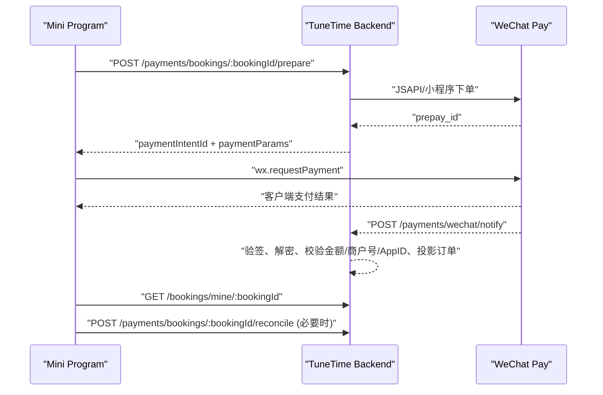

# 小程序端微信支付接入文档

本文面向 TuneTime 小程序端接入后端微信支付。当前后端采用微信支付 APIv3 普通商户模式：

- 小程序用户在小程序内发起约课支付。
- 微信支付收款进入 TuneTime 商户号账户。
- 后端以微信支付异步通知和主动查单为支付最终依据。
- 老师完课后的钱包入账、提现和微信商家转账由后端资金模块处理，不由小程序家长端判断。

## 1. 接入前提

后端支付能力依赖以下条件：

- 用户已登录，并且当前角色是 `GUARDIAN`。
- 用户账号已绑定微信小程序身份，后端能取到该用户在小程序 AppID 下的 `openid`。
- 预约单状态为 `PENDING_PAYMENT`，且 `payment.canRetry === true`。
- 后端环境变量中已配置微信支付商户号、商户 API 证书私钥、APIv3 密钥、微信支付平台公钥/证书，以及公网可访问的 `WECHAT_PAY_NOTIFY_URL`。

微信支付回调地址应配置为：

```text
https://<backend-domain>/payments/wechat/notify
```

不要使用 localhost、内网地址，也不要在回调 URL 上拼 query 参数。

## 2. 支付主流程



核心原则：

- `wx.requestPayment` 成功只代表微信客户端流程完成，不代表业务订单已经成功。
- 小程序端最终展示必须以后端订单详情或主动查单结果为准。
- 小程序端不要调用任何后台手工修复、测试支持、旧支付推进接口。

## 3. 拉起支付

### `POST /payments/bookings/:bookingId/prepare`

请求头：

```http
Authorization: Bearer <accessToken>
```

路径参数：

| 字段        | 说明    |
| ----------- | ------- |
| `bookingId` | 预约 ID |

请求体：无。

成功响应：

```json
{
  "paymentIntentId": "payment_intent_1",
  "intentStatus": "REQUIRES_PAYMENT",
  "expiresAt": "2026-04-10T13:30:00.000Z",
  "awaitingProviderNotification": false,
  "paymentParams": {
    "appId": "wx1234567890",
    "timeStamp": "1775808000",
    "nonceStr": "4c7f1e24d3b94c05a0a9f27534b7f4df",
    "package": "prepay_id=wx201410272009395522657a690389285100",
    "signType": "RSA",
    "paySign": "MEUCIQDB..."
  }
}
```

小程序端调用示例：

```ts
const { paymentParams } = await api.post(
  `/payments/bookings/${bookingId}/prepare`,
);

const { appId, ...requestPaymentParams } = paymentParams;

await wx.requestPayment({
  timeStamp: requestPaymentParams.timeStamp,
  nonceStr: requestPaymentParams.nonceStr,
  package: requestPaymentParams.package,
  signType: requestPaymentParams.signType,
  paySign: requestPaymentParams.paySign,
});
```

说明：

- `appId` 是后端签名时使用的小程序 AppID，返回给前端便于排障；`wx.requestPayment` 本身不需要传 `appId`。
- `package` 必须完整使用后端返回值，例如 `prepay_id=xxx`，不要改成纯 `prepay_id`。
- `paySign` 必须使用后端返回值，前端不要自行签名。
- 如果用户短时间重复点击支付，后端会复用未过期的 `prepay_id` 并重新生成调起支付签名。

## 4. 支付后刷新

### 推荐处理

`wx.requestPayment` 成功回调：

1. 回到订单详情页。
2. 立即请求 `GET /bookings/mine/:bookingId`。
3. 如果还不是 `paymentStatus === "PAID"`，前 10 秒每 2 秒轮询一次。
4. 仍未确认时展示“支付确认中”，允许用户点“刷新支付状态”。

`wx.requestPayment` 失败或取消：

1. 不要把本地订单改成失败终态。
2. 重新请求 `GET /bookings/mine/:bookingId`。
3. 如果后端返回 `payment.canRetry === true`，允许再次点击支付。

### `POST /payments/bookings/:bookingId/reconcile`

用于主动向微信查单并刷新后端订单状态。它是补偿接口，不是支付主入口。

请求头：

```http
Authorization: Bearer <accessToken>
```

请求体：无。

成功响应：

```json
{
  "bookingId": "booking_1",
  "paymentIntentId": "payment_intent_1",
  "intentStatus": "SUCCEEDED",
  "bookingStatus": "CONFIRMED",
  "paymentStatus": "PAID"
}
```

使用场景：

- `wx.requestPayment` 成功，但订单详情暂时没有变成已支付。
- 页面从后台切回前台，需要确认支付状态。
- 用户手动点击“刷新支付状态”。

## 5. 订单详情支付字段

小程序端读取订单详情时，重点看 `payment` 快照：

```json
{
  "status": "PENDING_PAYMENT",
  "paymentStatus": "UNPAID",
  "payment": {
    "intentId": "payment_intent_1",
    "intentStatus": "REQUIRES_PAYMENT",
    "amount": 183,
    "currency": "CNY",
    "dueAt": "2026-04-10T13:30:00.000Z",
    "canRetry": true,
    "awaitingProviderNotification": false,
    "lastSyncedAt": "2026-04-10T13:10:00.000Z"
  }
}
```

展示建议：

| 场景       | 推荐判断                                                                                   | UI 行为                          |
| ---------- | ------------------------------------------------------------------------------------------ | -------------------------------- |
| 待支付     | `status === "PENDING_PAYMENT"` 且 `payment.canRetry === true`                              | 展示“立即支付”                   |
| 支付确认中 | `payment.awaitingProviderNotification === true` 或 `payment.intentStatus === "PROCESSING"` | 展示“支付确认中”和“刷新支付状态” |
| 支付成功   | `paymentStatus === "PAID"` 且 `status === "CONFIRMED"`                                     | 隐藏支付按钮，展示已确认         |
| 支付超时   | `status === "EXPIRED"` 且 `paymentStatus === "UNPAID"`                                     | 展示订单已超时关闭               |
| 退款后     | `paymentStatus === "REFUNDED"`                                                             | 展示已退款，隐藏支付按钮         |

## 6. 前端禁止事项

小程序端不要做这些事：

- 不要调用 `PATCH /bookings/:id/payment`。该旧路由已从 controller 移除，不是正式支付入口。
- 不要调用后台人工修复接口来模拟支付成功。
- 不要调用 `/test-support/qa-scenario/mock-payment` 做真实支付流程。
- 不要把 `wx.requestPayment` 成功直接写成本地订单成功。
- 不要自行计算支付金额、拼 `package`、生成 `paySign`。

## 7. 常见错误

| 错误                                               | 常见原因                   | 处理                                               |
| -------------------------------------------------- | -------------------------- | -------------------------------------------------- |
| `当前账号尚未绑定微信小程序身份，无法发起微信支付` | 用户没有小程序 `openid`    | 先走小程序登录或绑定微信小程序身份                 |
| `当前预约状态不允许支付`                           | 订单不在 `PENDING_PAYMENT` | 重新拉取订单详情                                   |
| `当前预约已超过支付截止时间`                       | 订单支付窗口已过           | 刷新订单，按产品规则重新预约或等待后端重新生成订单 |
| `WeChat Pay is not fully configured`               | 后端微信支付环境变量缺失   | 后端检查部署环境                                   |
| 支付后订单未立刻成功                               | 微信回调延迟或页面轮询太快 | 轮询订单详情，必要时调用 `reconcile`               |

## 8. 当前后端覆盖范围

已实现并收口：

- 小程序 JSAPI 下单。
- 小程序调起支付参数签名。
- 未过期 `prepay_id` 复用。
- 支付回调 raw body 验签、时间戳校验、平台序列号校验、AES-GCM 解密。
- 微信 API 应答验签。
- 回调/查单前校验 `appid`、`mchid`、订单号、币种、支付成功金额。
- 商户订单号查单。
- 未支付订单关单。
- 支付超时巡检。

新增后端资金闭环能力：

- 退款：后台为未结算已支付预约发起全额退款、主动查询退款、处理微信退款回调；退款成功后会把本地支付意图和预约投影为已退款。
- 老师钱包：完课确认且 `settlementReadiness === "READY"` 后，后端会幂等入账老师钱包；老师入账金额为 `订单总额 - 平台服务费`。
- 提现打款：老师可创建提现申请；后台审核通过后才会锁定钱包余额并发起微信商家转账；转账回调/查单会处理成功、失败和取消后的余额冲正。
- 对账：后台可按日期触发微信交易账单和退款账单对账，下载账单后校验 hash，并生成差异项；差异项只进入处理队列，不自动改账。
- 运营后台：已提供退款申请/查单、预约结算入账、提现审核/拒绝/查单、微信账单对账入口；所有后台资金动作写入 `AdminAuditLog`。

老师端新增接口：

| 接口                          | 说明                      |
| ----------------------------- | ------------------------- |
| `GET /wallet/me`              | 查看老师钱包可用/冻结余额 |
| `GET /wallet/me/transactions` | 查看老师钱包流水          |
| `POST /payouts`               | 创建提现申请              |
| `GET /payouts/me`             | 查看我的提现申请          |

后台新增接口：

| 接口                                                 | 说明                           |
| ---------------------------------------------------- | ------------------------------ |
| `POST /admin/payments/bookings/:bookingId/refunds`   | 为预约发起未结算全额退款       |
| `POST /admin/payments/refunds/:id/reconcile`         | 主动查询并同步退款单           |
| `POST /admin/settlements/bookings/:bookingId/settle` | 手动触发预约结算入老师钱包     |
| `POST /admin/payouts/:id/approve`                    | 审核通过提现并发起微信商家转账 |
| `POST /admin/payouts/:id/reject`                     | 拒绝提现申请                   |
| `POST /admin/payouts/:id/reconcile`                  | 主动查询并同步微信商家转账     |
| `POST /admin/reconciliation/wechat/runs`             | 触发微信交易/退款账单对账      |

微信新增回调地址：

```text
https://<backend-domain>/payments/wechat/refund-notify
https://<backend-domain>/payments/wechat/transfer-notify
```

仍需注意：

- 当前退款 MVP 只开放未结算订单全额退款，不开放家长自助退款和部分退款。
- `WECHAT_PAY_TRANSFER_ENABLED` 默认应保持 `false`，只有商家转账权限、场景 ID、报备信息、通知地址都确认后再打开。
- 商家转账可能返回 `WAIT_USER_CONFIRM`，后端会保存 `packageInfo`，老师端后续可用它接入确认收款。

## 9. 参考文档

- 微信支付 JSAPI/小程序下单：https://pay.wechatpay.cn/doc/v3/merchant/4012791897
- 微信支付平台证书验签名：https://pay.wechatpay.cn/doc/v3/merchant/4013053420
- 微信支付商家转账：https://pay.wechatpay.cn/doc/v3/merchant/4012716434
